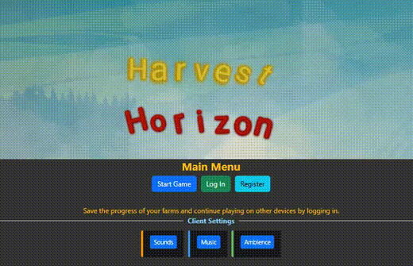

# Harvest Horizon

**Live Demo:** *[farm.blinter.link](https://farm.blinter.link)*

## Game Tutorial

**Getting Started:**

1. After logging in, you'll see the main menu.
2. For a full experience, visit the Characters tab to create your farmer character, then go to the Maps tab and create your farm land.
3. Mark both your character and map as favorites (look for the star icon).
4. The "Start Game" button will light up once you've selected favorites.
5. Click it to begin your farming adventure!

*Alternatively, you can just click "Start Game" right away to jump in quickly.*

When you're done, you can delete your temporary user account by clicking the **Delete User** button in your profile or account settings. It is not saved past the browser session.

**In-Game Controls:**

* **Moving Around:** Use WASD keys or arrow keys to navigate your farm.
* **Selecting Tiles:** Click and drag to create a selection box for performing actions on multiple tiles.
* **Your Screen:** The top half shows your farm map, while the bottom displays your action bar and tile information.

**Important Game Mechanics:**

* You must lease land before you can farm it. Look for the lease option in your action bar.
* When rent is due, you'll need to renew your lease to continue using that land.
* To plant crops, you'll need seeds from the marketplace.
* Access your inventory by returning to the Main Menu or opening another browser tab.

**Helpful Tips:**

* Your farm name appears at the top of the screen (you can hide it if you prefer).
* The game automatically adjusts to fit your screen size.
* Remember that you can only view areas where you have a valid lease.
* You can open multiple sessions. Work on multiple maps and characters at the same time.
* Login is saved as a token in local storage, but it is cleared when you log out.
* On the map, you won't be able to see your coins unless you spend it. It shows on the bottom right then disappears after a short delay.
* If there's something not working, try scrolling up on your UI to see the message. There may be a error message in your console messages that show what went wrong.
* If you have comments, just reach out with an issues ticket.

Happy farming!


---
### Main Menu



### Selection


### Inventory/Market


### Harvesting


---

### Dev Notes
- If actually playing the game, any saved user and game data will be deleted to ensure fresh database integrity.
- Initial work done to push WebGL + React components to the limits on the same page, and more mobile support for movement interactions + zooming will be added once testing suites can be well designed to handle profiling.
- Very limited gameplay, most game mechanics and balancing variables have been defined, but the game is not yet ready for public play.
- Ensure Testing Suites up to E2E tests are well designed first and profiling can be done before refactoring the codebase.

**Version:** `0.0.1`

This idea was selected as part of a Capstone:

See [**Capstone 2 Ideas**](./RepositoryDocs/Capstone2/Capstone_2_Ideas.md) and [**Capstone 2 Proposal**](./RepositoryDocs/Capstone2/Capstone_2_Proposal.md)
Since then, Pixi.js was swapped to Phaser.

**Development:** 
  - For full setup and development instructions, see [DEVELOPMENT](./RepositoryDocs/DEVELOPMENT.md).
  - For architecture: see [ARCHITECTURE](./RepositoryDocs/ARCHITECTURE.md).
  - For credits: see [CREDITS](./RepositoryDocs/CREDITS.md).

## Table of Contents
- [Harvest Horizon!](#harvest-horizon)
  - [Game Tutorial](#game-tutorial)
    - [Main Menu](#main-menu)
    - [Selection](#selection)
    - [Inventory/Market](#inventorymarket)
    - [Harvesting](#harvesting)
    - [Dev Notes](#dev-notes)
  - [Table of Contents](#table-of-contents)
  - [Description](#description)
  - [Key Features](#key-features)
  - [Tech Stack](#tech-stack)
    - [**1. Special Hybrid Architecture**](#1-special-hybrid-architecture)
    - [**2. Development Server Integration (Vite Proxy)**](#2-development-server-integration-vite-proxy)
    - [**3. Frontend Architecture**](#3-frontend-architecture)
    - [**4. Components and Modules**](#4-components-and-modules)
      - [Key Custom Services \& Modules](#key-custom-services--modules)
      - [State Management](#state-management)
      - [Testing](#testing)
    - [Backend](#backend)
    - [**Core Technologies \& Versions**](#core-technologies--versions)
      - [Frontend](#frontend)
      - [Backend](#backend-1)
      - [Development \& Tooling](#development--tooling)
  - [Documentation](#documentation)
  - [License](#license)
  - [Credits](#credits)


## Description

Immerse yourself in **Harvest Horizon**, where farming meets strategy in a vibrant ecosystem. Tend to your plot of digital soil, where every seed planted triggers a cascade of real-time events across the game world. Watch as your crops visually progress to harvest, and expand your farm to new frontiers.

What sets Harvest Horizon apart is its ability to grow agricultural empires, trade resources in the dynamic marketplace, or compete for the most bountiful harvests. A relaxing, breathing farm simulation where strategy and timing are just as important as the seeds you sow. Will you focus on rapid crop rotation for quick profits, or invest in rare, high-value crops for long-term gains and skill unlocks? The choice—and the farm—is yours to cultivate.

Harvest Horizon is a sophisticated farming simulation game that combines strategic resource management with strategic and fine-control over gameplay decisions. Built on a modern tech stack featuring [Phaser.js](https://phaser.io/) for the game engine and [Node.js/Express](https://expressjs.com/) for the backend, the game delivers a responsive and visually pleasing farming experience.

At its core, the game features a meticulously designed tile-based farming system where players can cultivate various crops, each with unique growth patterns, yield values, and market demands. The multi-layered rendering system allows for complex visual representations, with separate layers for soil conditions, crops, decorations, and interactive elements.

The multiplayer experience is powered by [Socket.IO](https://socket.io/) with binary protocol optimization, enabling real-time synchronization of game states across multiple clients. This allows for collaborative farming, resource trading, and competitive leaderboards, all secured through [JWT](https://jwt.io/) authentication and comprehensive security measures.

With its event-driven architecture, Harvest Horizon creates a dynamic world where player actions have cascading effects, crops respond to time and care, and the farming community evolves organically through player interaction and strategic decision-making.

## Key Features

- **Advanced Farming Simulation**  
  - Phaser.js-powered interactive farming
  - [31×31] tile grid with performant multi-layer rendering architecture
  - Dynamic crop planting, growth, and harvesting mechanics
  - Real-time visual feedback for player actions
  - Rent overlay for temporarily controlling land

- **Seamless Crop Management**  
  - Event-driven growth system featuring  
    - 5-stage procedural growth cycles with visual progression
    - Optimized crop information processing on User Interface
    - Time-based growth mechanics with real-time updates
    - Crop-level specific growth rates and yield values
    - Notification overlay for harvest ready crops

- **Real-Time Multiplayer-Ready Experience**  
  - Socket.IO-powered real-time synchronization
  - Event-based architecture for responsive gameplay
  - Multi-client synchronization with conflict resolution
  - Authenticated WebSocket connections using JWT
  - Real-time game manipulation across all connected clients

- **High Capacity Express.js Server**  
  - Scalable and modular Node.js/Express backend designed for high capacity.

- **Hybrid Database Architecture**  
  - Utilizes PostgreSQL and MongoDB
  - Leverages PostgreSQL for relational data integrity and fast lookups
  - Uses MongoDB for flexible document storage (inventories, logs)
  - Designed for scalability and efficient data access
  - Prioritizes efficient data storage and retrieval
  - Offloads computation to the client where feasible
  - Employs strategies to minimize storage footprint per user

- **Modern Development Pipeline**  
  - Vite-powered HMR development
  - Express.js server with hot-reloading for backend development
  - Scripts and code-style management
  - Relevant npm commands/scripts
  - Reactstrap UI component library
  - SonarQube static analysis
  - ESLint + Prettier for code quality

- **Security Framework**  
  - Comprehensive security measures including secure authentication (JWT, refresh tokens), password hashing (bcrypt), protection against common vulnerabilities (injection attacks), and robust input validation.

---

## Tech Stack 

### **1. Special Hybrid Architecture**

This project utilizes a hybrid architecture combining a Phaser-based game
engine rendered via WebGL with a React-based UI layer. During development,
this involves running the Vite development server for the frontend
simultaneously with the Node.js/Express backend server.

### **2. Development Server Integration (Vite Proxy)**

To facilitate seamless communication between the frontend (served by Vite
on its own port) and the backend (typically running on port 3000) during
development, Vite's `server.proxy` feature is configured in
`vite.config.js`:

- **API Proxy:** Requests made from the frontend application to paths
  starting with `/api` (e.g., `/api/users`, `/api/inventory`) are
  automatically forwarded by the Vite dev server to the backend server
  at `http://localhost:3000`.
- **WebSocket Proxy:** Similarly, WebSocket connections initiated for
  Socket.IO (under the `/socket.io` path) are proxied to the backend,
  enabling real-time features like multi-session synchronization and 
  potentially multiplayer features.

This configuration allows developers to benefit from Vite's fast HMR and
development experience for the frontend, while the frontend code can make
API calls and establish WebSocket connections as if the backend were running
on the same origin, simplifying development workflows.

Build configurations (like `manualChunks` in `vite.config.js`) also
complement this by optimizing the frontend assets for production deployment
within this hybrid structure.

### **3. Frontend Architecture**
- **Game Engine**
  - Custom plugin architecture for modular game features
  - Optimized sprite and asset management

- **UI Framework**
  - **React Router 7.5.3** - Client-side navigation and routing
  - **Vite 6.3.5** - Fast HMR development and optimized production builds
  - **Terser 5.39.0** - Used for advanced minification in Vite production builds

- **Styling & Components**
  - **Bootstrap 5.3.6** - Responsive layout foundation
  - **Reactstrap 9.2.3** - React-integrated Bootstrap components

- **Real-time Communication**
  - **Socket.IO Client 4.8.1** - WebSocket-based real-time data sync
  - Binary protocol optimization for game state transmission
  - Event-driven architecture for responsive multiplayer

- **Form Management**
  - **Formik 2.4.6** - Library for simplifying form building, validation,
    and submission state in React

- **Data Fetching**
  - **Axios 1.9.0** - Promise-based HTTP client for API communication

### **4. Components and Modules**
- **Game** (`/src/game`)
  - Phaser scene manager with custom plugins
  - Modular architecture, segmented modules to allow for easy development and testing
- **UI** (`/src/components`)
  - React hooks for game state management
  - Memoized components to improve performance according to React best practices
  - Compartamentalized architecture for better code organization and code-reuse
  - Fine-tuned state management for proper handling of component behavior
  - Efficient prop management for component communication and controlled re-renders
- **API** (`/src/api`)
  - Generation of endpoint routes in a library file for special routes
  - Axios for HTTP requests
  - Validation checks of API requests before transmission
  - Error handling for API requests
- **Library** (`/src/library`)
  - Dedicated authentication library using JWT + Refresh Tokens
  - Local storage for session management

#### Key Custom Services & Modules

Beyond the core libraries, several key custom modules form the backbone
of the application's specific functionality:

- **Authentication Service:** 
  Manages the full user authentication lifecycle, including login/signup
  API calls, JWT generation, verification, and refresh token logic.
- **ItemRenderer:**
  A specialized Phaser component responsible for rendering game items
  efficiently onto the map. Implements performance optimizations like
  object pooling and viewport culling to handle potentially large numbers
  of items smoothly.
- **MapService:**
  Handles the loading, parsing, and providing of game map data (tile layers,
  object layers, collision information) needed by Phaser scenes to
  construct the game world.
- **InputHandler:**
  Processes and translates raw user input (keyboard, mouse, touch) into
  meaningful game actions (e.g., character movement, interaction prompts)
  within the Phaser context.
- **AudioManager:**
  Manages all audio aspects, including loading sound assets (SFX, music),
  controlling playback (play, stop, loop), managing volume levels, and
  potentially handling spatial audio.
- **Crop Utilities:**
  Provides a set of utility functions specifically for handling crop
  logic, potentially including growth calculations, state transitions,
  or planting/harvesting validation.
- **Game Data Management:**
  Serves as a central repository or manager for static game data like
  item definitions, crop types, building stats, costs, etc., ensuring
  consistent access across different game systems.

#### State Management
- **Event-Driven Architecture**
  - EventBus implementation for pub/sub pattern
  - Decoupled component communication
  - Game state synchronization

- **Custom Error Handling System**
  - `usePhaserErrorHandling` hook for game errors
  - Centralized error handler for API and authentication errors
  - Catchall error handler for uncaught exceptions

- **React State Management**
  - **Efficient Updates:** Leverages `useCallback` and `useMemo` hooks
    extensively to optimize component rendering and prevent unnecessary
    updates, ensuring a smooth user interface experience.
  - **Shared State:** Utilizes the Context API (`React.createContext`)
    for managing global state like user authentication and settings,
    providing a clean way to pass data through the component tree.
    See `src/components/context/UserProvider.jsx` for an example.
  - **API State Integration:** Handles asynchronous operations and state
    (loading, data, errors) derived from interactions with the dedicated
    API layer (`/src/api`), updating component state or shared context
    accordingly.
  - **Performance:** State updates are structured to minimize re-renders,
    contributing to overall application performance.

- **Rendering Optimizations**
  - **WebGL Pipeline:** Utilizes Phaser's WebGL renderer for hardware-
    accelerated graphics, enabling complex visual effects and smooth
    animations even with many on-screen elements.
  - **Object Pooling:** Reuses game objects (like sprites, effects) instead
    of creating/destroying them frequently. This significantly reduces
    garbage collection pauses and improves memory efficiency.
    See `src/game/scenes/NewGame/ItemRenderer.js`.
  - **Viewport Culling:** Renders only objects currently visible within the
    player's viewport, drastically reducing draw calls and GPU load,
    especially in large game worlds.
  - **Depth Sorting:** Optimized algorithms manage rendering order (depth)
    efficiently, preventing visual glitches and unnecessary overdraw.

- **Asset Management**
  - **Strategic Preloading:** Loads essential assets during dedicated loading
    screens, ensuring they are available immediately when needed, providing
    a smoother gameplay start.
  - **Lazy Loading:** React components and non-critical assets are loaded
    on demand using `React.lazy` and Suspense, reducing the initial
    bundle size and speeding up application load time.
  - **Optimized Audio:** Prioritizes loading critical sound effects and
    music, potentially using efficient formats to minimize bandwidth usage
    and loading delays.
  - **Spritesheet Packing:** Consolidates multiple images into spritesheets,
    reducing the number of HTTP requests needed and optimizing texture
    memory usage on the GPU.

- **Build Optimizations**
  - **Code Splitting:** Manual configuration ensures vendor libraries and
    logical application sections are split into separate chunks. This allows
    the browser to cache libraries effectively and load only necessary
    code for the initial view, improving TTI (Time To Interactive).
  - **Sourcemaps:** Generated for production builds to aid debugging without
    significantly impacting runtime performance for end-users.
  - **Build Tool Tuning:** Optimized Rollup/Vite configuration minimizes
    output bundle size through techniques like tree-shaking and code
    minification.
  - **Efficient Networking:** Uses Socket.IO's binary protocol (where
    applicable) for real-time communication, reducing network payload size
    and latency compared to standard JSON messaging.

#### Testing
- Initial testing structure was done including populating test data and E2E testing environment setup instructions, but due to the changing nature of the project, only the framework details have been documented but have yet to be implemented.
- E2E and complete test suites were expensive to calculate during development, and complete refactors of the front-end would increase the time cost of having to completely rewrite the testing structure.
- Thorough debug logs have been added for most problematic or relevant pieces of code to speed up debugging and further development.

### Backend

The backend is built with Node.js and Express, designed for scalability
and real-time capabilities. It resides primarily in the `/server`
directory but leverages shared modules from `/src/library`.

- **Core Framework:**
  - **Node.js:** Provides the asynchronous, event-driven runtime.
  - **Express.js:** Serves as the web application framework, handling
    routing, middleware, and request/response cycles.

- **Architecture & Structure (`/server`):**
  - **Modular Design:** Organized into standard directories like `routes/`,
    `controllers/`, `models/`, `middleware/`, and `config/` for clarity
    and maintainability.
  - **RESTful API:** Exposes a RESTful API for frontend interaction,
    following standard HTTP methods and status codes.
  - **Middleware Pipeline:** Utilizes middleware extensively for concerns
    like request logging, body parsing, authentication (JWT verification),
    input validation, and centralized error handling.

- **Real-time Communication:**
  - **Socket.IO:** Integrated for handling real-time events such as
    multiplayer actions, chat messages, and game state synchronization,
    providing low-latency bidirectional communication.

- **Database Layer:**
  - **PostgreSQL (Primary):** Managed via the `pg` library. Used for core
    relational data (e.g., user accounts, farm layouts, structured game
    data). Schemas are carefully designed with appropriate indexing for
    query performance.
  - **MongoDB (Secondary):** Interacted with using `Mongoose` ODM. Suitable
    for less structured or rapidly evolving data (e.g., player logs, item
    metadata, potentially chat history).
  - **Query Optimization:** Focus on writing efficient database queries
    and leveraging database features for performance.

- **Library Integration (`/src/library`):**
  - The backend accesses shared, isomorphic modules from `/src/library`,
    promoting code reuse between frontend and backend where applicable.
  - Server and Client-side libraries are separated for ease of use and organization.
    - Server-Side Libraries: (`/server/library/`)
    - Client-Side Libraries: (`/src/library/`)
    - *Shared Libraries*: (`/src/library/`)
  - **Authentication:** Leverages the dedicated authentication library in
    `/src/library` for JWT generation, verification, and refresh token
    logic.
  - **Utilities:** May utilize shared utility functions for common tasks.

- **Security:**
  - **Authentication:** Secure JWT-based authentication and authorization.
  - **Password Security:** Uses `bcrypt` for hashing user passwords.
  - **Input Validation:** Rigorous validation and sanitization of all incoming
    request data (body, params, query) to prevent injection attacks.
  - **Rate Limiting:** (If implemented) Protects against brute-force attacks.
  - **Security Headers:** Uses `Helmet.js` or similar middleware to set
    security-related HTTP headers.

- **Error Handling:**
  - Centralized error handling middleware catches errors from route handlers
    and middleware, logging them appropriately and sending standardized
    error responses to the client.

### **Core Technologies & Versions**

#### Frontend
- **Framework:** [React](https://react.dev/) (`^19.1.0`)
- **Routing:** [React Router](https://reactrouter.com/) (`^7.5.3`)
- **Game Engine:** [Phaser](https://phaser.io/) (`^3.88.2`)
- **UI Components:** [Reactstrap](https://reactstrap.github.io/) (`^9.2.3`),
  [Bootstrap](https://getbootstrap.com/) (`^5.3.6`)
- **Form Handling:** [Formik](https://formik.org/) (`^2.4.6`)
- **Data Fetching:** [Axios](https://axios-http.com/) (`^1.9.0`)
- **Real-time:** [Socket.IO Client](https://socket.io/) (`^4.8.1`)
- **Build Tool:** [Vite](https://vitejs.dev/) (`^6.3.5`)
- **Minification:** [Terser](https://terser.org/) (`^5.39.0`) used for
  production builds in Vite.

#### Backend
- **Runtime:** [Node.js](https://nodejs.org/) (`v22.14.0`)
- **Framework:** [Express](https://expressjs.com/) (`^5.1.0`)
- **Real-time:** [Socket.IO](https://socket.io/) (`^4.8.1`)
- **Databases:**
  - PostgreSQL (`17.4`) via [pg](https://node-postgres.com/) (`^8.15.6`)
  - MongoDB (`7.0.18`) via [Mongoose](https://mongoosejs.com/) (`^8.14.1`)
- **Authentication:** [jsonwebtoken](https://github.com/auth0/node-jsonwebtoken)
  (`^9.0.2`), [bcrypt](https://github.com/kelektiv/node.bcrypt.js) (`^5.1.1`)

#### Development & Tooling
- **Linting/Formatting:** ESLint, Prettier
- **Documentation:** JSDoc

## Documentation

The codebase is documented using JSDoc. To generate the documentation:

```bash
# Install dependencies
npm install

# Generate documentation
npm run docs
```

This will create HTML documentation in the `docs/jsdoc` directory.

## License

MIT License - See [LICENSE](LICENSE.md)

## Credits

See [CREDITS](RepositoryDocs/CREDITS.md)